# MiniCoin – Algoritmy a princípy

## Obsah

1. [Ako funguje ťažba v Bitcoine](#ako-funguje-ťažba-v-bitcoine)
2. [Proof of Work (Dôkaz prácou)](#proof-of-work-dôkaz-prácou)
3. [Implementácia v MiniCoin](#implementácia-v-minicoin)
4. [Štruktúra bloku](#štruktúra-bloku)
5. [Transakcie](#transakcie)
6. [Validácia blockchainu](#validácia-blockchainu)
7. [Konsenzus – najdlhší reťazec vyhráva](#konsenzus--najdlhší-reťazec-vyhráva)
8. [Peňaženka a digitálne podpisy](#peňaženka-a-digitálne-podpisy)
9. [P2P sieť](#p2p-sieť)
10. [Porovnanie MiniCoin vs Bitcoin](#porovnanie-minicoin-vs-bitcoin)

---

## Ako funguje ťažba v Bitcoine

Bitcoin je decentralizovaná digitálna mena, ktorá funguje bez centrálnej autority (banky). Aby sieť mohla bezpečne zaznamenávať transakcie bez dôveryhodného prostredníka, používa mechanizmus nazývaný **Proof of Work** (dôkaz prácou).

### Prečo ťažba trvá zámerne dlho?

Ťažba je **úmyselne výpočtovo náročná**. Toto nie je chyba, je to kľúčová vlastnosť systému:

1. **Bezpečnosť**: Ak by bolo jednoduché vytvoriť nový blok, útočník by mohol rýchlo vytvoriť alternatívnu verziu blockchainu a prepísať históriu transakcií (tzv. double-spending útok). Tým, že vytvorenie bloku vyžaduje obrovské množstvo výpočtovej práce, útočník by musel ovládať väčšinu výpočtového výkonu celej siete.

2. **Regulácia rýchlosti**: Bitcoin automaticky upravuje obtiažnosť ťažby tak, aby nový blok vznikol približne **každých 10 minút**. Toto zabezpečuje, že bloky nevznikajú príliš rýchlo (čo by spôsobilo chaos v sieti) ani príliš pomaly (čo by spomalilo spracovanie transakcií).

3. **Spravodlivé rozdeľovanie mincí**: Nové bitcoiny vznikajú ako odmena za ťažbu. Pomalá a predvídateľná produkcia blokov zabezpečuje kontrolovanú emisiu meny.

### Ako ťažba funguje krok za krokom

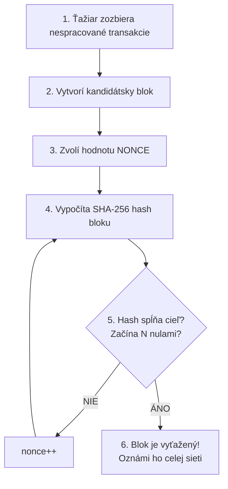

**Nonce** je náhodné číslo, ktoré ťažiar mení, aby dostal iný hash. Hash funkcia SHA-256 je jednosmerná, nedá sa predpovedať, aký hash dostaneme, musíme skúšať.

### Obtiažnosť (Difficulty) v Bitcoine

- Hash musí začínať určitým počtom **vedúcich núl**
- Čím viac núl sa vyžaduje, tým je to ťažšie (exponenciálne)
- Bitcoin upravuje obtiažnosť každých **2 016 blokov** (~2 týždne)
- Ak sa bloky ťažili rýchlejšie ako 10 min → obtiažnosť sa zvýši
- Ak sa ťažili pomalšie → obtiažnosť sa zníži
- V roku 2024 vyžaduje Bitcoin ~19+ vedúcich núl, čo znamená bilióny pokusov

### Odmena za ťažbu

- Ťažiar, ktorý nájde platný blok, dostane odmenu (block reward)
- Pôvodne 50 BTC, každých ~4 roky sa halvuje (halving)
- 2009: 50 BTC → 2012: 25 BTC → 2016: 12.5 BTC → 2020: 6.25 BTC → 2024: 3.125 BTC
- Navyše dostáva transakčné poplatky zo všetkých transakcií v bloku

---

## Proof of Work (Dôkaz prácou)

Proof of Work je konsenzuálny mechanizmus, ktorý rieši problém: **Ako sa dohodnúť na jednej verzii pravdy v sieti, kde si nikto nedôveruje?**

### Princíp

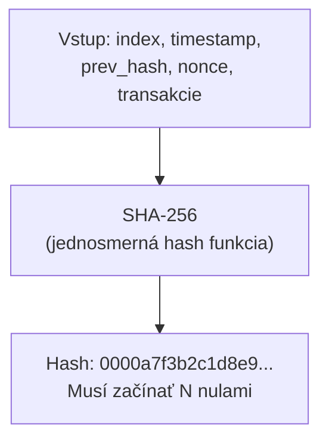

- Ťažiar nemôže podvádzať – hash sa nedá "vybrať", musí sa nájsť hrubou silou
- Overenie je okamžité, stačí raz vypočítať hash a skontrolovať nuly
- **Asymetria**: Nájsť platný hash je ťažké, overiť ho je jednoduché

### Prečo SHA-256?

- Deterministická: rovnaký vstup = rovnaký výstup
- Lavínový efekt: zmena 1 bitu vstupu zmení ~50% bitov výstupu
- Jednosmerná: z hashu sa nedá zistiť vstup
- Bezkolízna: je prakticky nemožné nájsť dva rôzne vstupy s rovnakým hashom

---

## Implementácia v MiniCoin

MiniCoin implementuje zjednodušenú verziu Bitcoin protokolu v jazyku C.

### Hash výpočet bloku

Funkcia `block_compute_hash()` v `src/block.c`:

```
hash = SHA-256(index || timestamp || prev_hash || nonce || tx_hash1 || tx_hash2 || ...)
```

Všetky polia bloku sa zreťazia do jedného reťazca a zahashujú sa funkciou SHA-256 cez OpenSSL EVP rozhranie. Výsledok je 64-znakový hexadecimálny reťazec.

### Ťažba bloku

Funkcia `block_mine()` v `src/block.c`:

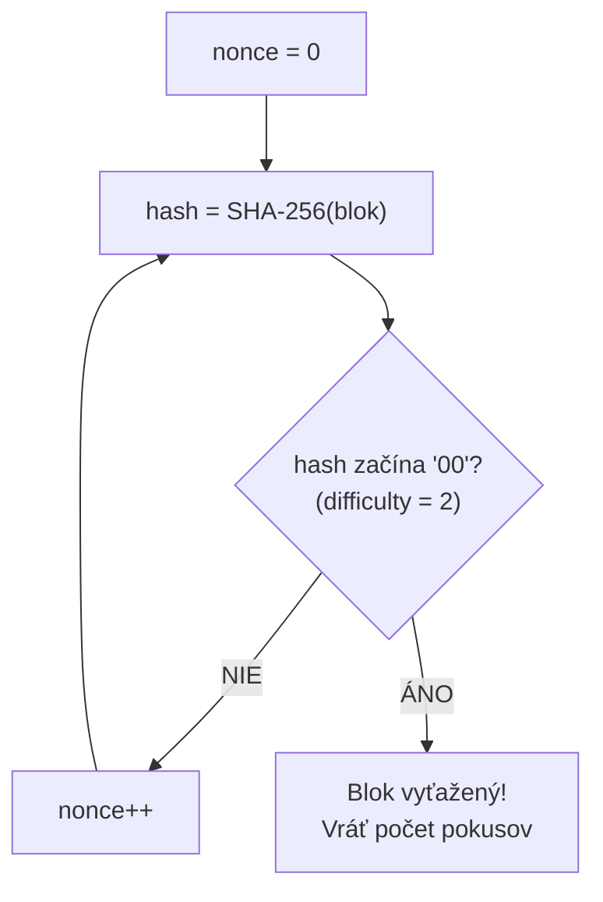

- **Obtiažnosť**: Fixná hodnota `MINING_DIFFICULTY = 2` (2 vedúce nuly)
- **Priemerný počet pokusov**: ~256 (16² = 256, lebo každý hex znak má 16 možností)
- **Čas ťažby**: Mikrosekundy až milisekundy na modernom hardvéri
- Aplikácia používa vizuálnu animáciu simulujúcu realistický čas ťažby

### Validácia bloku

Funkcia `block_validate()` v `src/block.c`:

1. Prepočíta hash z dát bloku (bez uloženého hashu)
2. Overí, že prepočítaný hash = uložený hash
3. Overí, že hash začína požadovaným počtom núl

---

## Štruktúra bloku

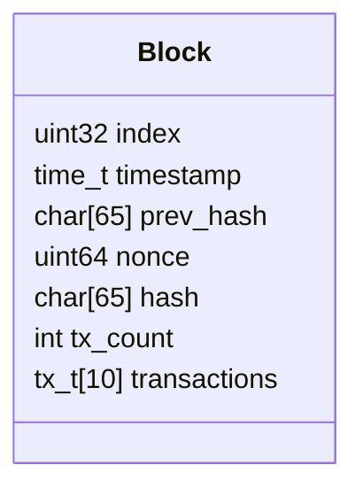

### Genesis blok (blok 0)

- Index: 0
- Timestamp: `1231006505` (3. január 2009 – rovnaký ako Bitcoin genesis)
- Bez transakcií
- prev_hash: samé nuly
- Vyťažený s obtiažnosťou 2

### Prepojenie blokov

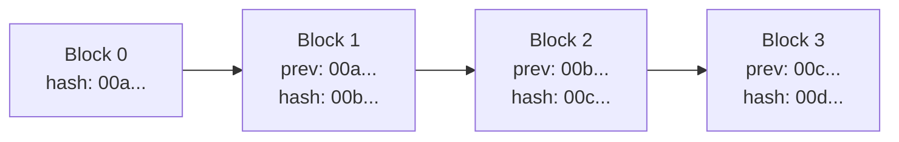

Každý blok obsahuje hash predchádzajúceho bloku. Ak niekto zmení transakciu v starom bloku, zmení sa jeho hash, čo rozbije prepojenie so všetkými nasledujúcimi blokmi – celý reťazec sa zneplatní.

---

## Transakcie

### Štruktúra transakcie

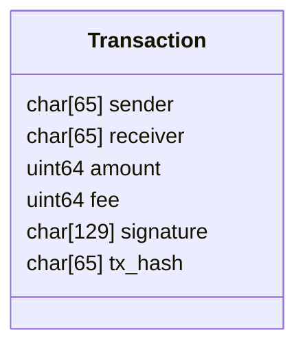

### Hash transakcie

```
tx_hash = SHA-256(sender || receiver || amount || fee)
```

Podpis nie je súčasťou hashu – podpisuje sa samotný tx_hash.

### Coinbase transakcia

Špeciálna transakcia, ktorá vytvára nové mince:
- Odosielateľ: `"COINBASE"` (špeciálny reťazec)
- Príjemca: adresa ťažiara
- Suma: `MINING_REWARD (50)` + súčet poplatkov zo všetkých transakcií v bloku
- Nevyžaduje overenie podpisu

### Mempool

- Pole až 100 čakajúcich transakcií
- Chránené mutexom (thread-safe)
- Pri ťažbe: coinbase transakcia sa pridá ako prvá, potom až 9 ďalších z mempoolu
- Transakcie s nedostatočným zostatkom sa preskočia

---

## Validácia blockchainu

Funkcia `chain_validate()` v `src/chain.c`:

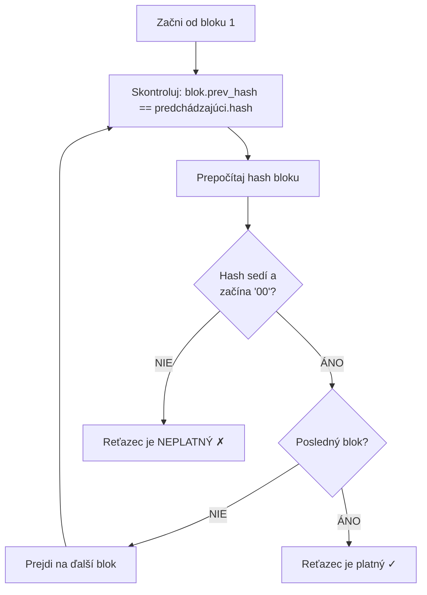

### Výpočet zostatku

Funkcia `chain_get_balance()`:
- Prechádza všetky bloky a transakcie
- Ak je adresa príjemca: +amount
- Ak je adresa odosielateľ: -(amount + fee)
- Zjednodušený model (nie plný UTXO model ako Bitcoin)

---

## Konsenzus – najdlhší reťazec vyhráva

Ak dva ťažiari nájdu blok približne v rovnakom čase, vznikne **fork** (rozvetvenie):

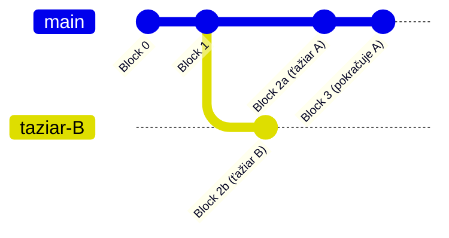

### Riešenie v MiniCoin

Funkcia `chain_replace()` v `src/chain.c`:

1. Prijme blockchain od iného uzla
2. Ak je **dlhší** než lokálny A zároveň **platný** → nahradí lokálny
3. Ak je rovnako dlhý alebo kratší → ignoruje

Takto sa celá sieť postupne zhodne na jednej verzii blockchainu.

---

## Peňaženka a digitálne podpisy

### Kryptografia

- **Algoritmus**: Ed25519 (eliptická krivka, cez OpenSSL)
- **Verejný kľúč**: 32 bajtov → 64-znakový hex reťazec (= adresa)
- **Súkromný kľúč**: Uložený v PEM súbore (`wallet.pem`)

### Proces podpisovania transakcie

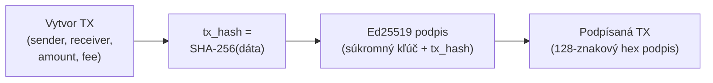

### Overenie podpisu

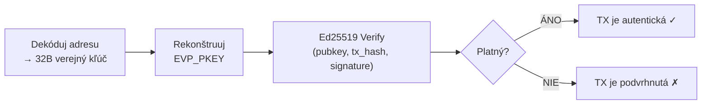

---

## P2P sieť

### Architektúra

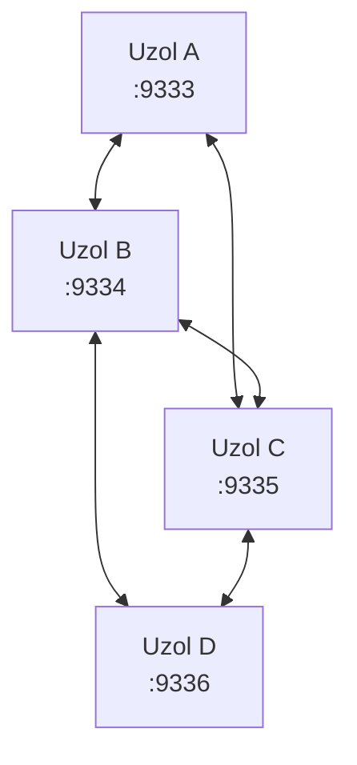

- TCP server na konfigurovateľnom porte (predvolený: 9333)
- Maximálne 16 súčasných pripojení (peers)
- Každý peer beží vo vlastnom vlákne
- Komunikácia: JSON cez TCP, oddelené novým riadkom

### Typy správ

| Typ | Popis |
|-----|-------|
| `MSG_NEW_BLOCK` | Oznam o novom vyťaženom bloku |
| `MSG_NEW_TX` | Oznam o novej transakcii |
| `MSG_REQUEST_CHAIN` | Žiadosť o celý blockchain |
| `MSG_CHAIN_RESPONSE` | Odpoveď s celým blockchainom |
| `MSG_PEER_LIST` | Zdieľanie zoznamu známych uzlov |
| `MSG_PING` / `MSG_PONG` | Kontrola dostupnosti |

### Synchronizácia

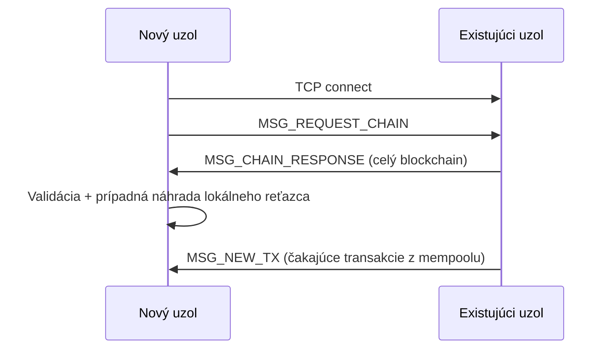

### Serializácia (protocol.c)

- Vlastná implementácia JSON (bez externej knižnice)
- Manuálny parsing pomocou string funkcií (`strstr`, `strchr`)
- Podpora vnorených štruktúr (polia blokov obsahujúce polia transakcií)

---

## Porovnanie MiniCoin vs Bitcoin

| Vlastnosť | MiniCoin | Bitcoin |
|-----------|----------|---------|
| Hash funkcia | SHA-256 | SHA-256 (double) |
| Obtiažnosť | Fixná (2 nuly) | Dynamická (~19+ núl) |
| Úprava obtiažnosti | Žiadna | Každých 2 016 blokov |
| Cieľový čas bloku | N/A | ~10 minút |
| Odmena za blok | 50 mincí (fixná) | 3.125 BTC (halving) |
| Max transakcií/blok | 10 | ~2 000-4 000 |
| Model zostatkov | Kumulatívny súčet | UTXO |
| Podpisy | Ed25519 | ECDSA (secp256k1) |
| Adresa | Surový verejný kľúč | Hash verejného kľúča + Base58 |
| Sieť | TCP, max 16 peers | TCP, tisíce uzlov |
| Scripting | Žiadny | Bitcoin Script |
| Merkle strom | Nie | Áno |
| Halving | Nie | Áno (~4 roky) |
| SegWit / Lightning | Nie | Áno |

### Čo MiniCoin zjednodušuje

1. **Žiadna úprava obtiažnosti** – v reálnom Bitcoine je dynamická
2. **Žiadny Merkle strom** – Bitcoin hashuje transakcie do stromu, MiniCoin ich jednoducho zreťazí
3. **Zjednodušený model zostatkov** – namiesto UTXO modelu používa kumulatívny súčet
4. **Fixná odmena** – bez halvingu
5. **Jednoduchá serializácia** – vlastný JSON namiesto binárneho formátu
6. **Malá sieť** – max 16 uzlov, bez discovery mechanizmu

MiniCoin slúži ako **vzdelávacia implementácia** – demonštruje základné princípy blockchainu a kryptomeny v zrozumiteľnom kóde.
