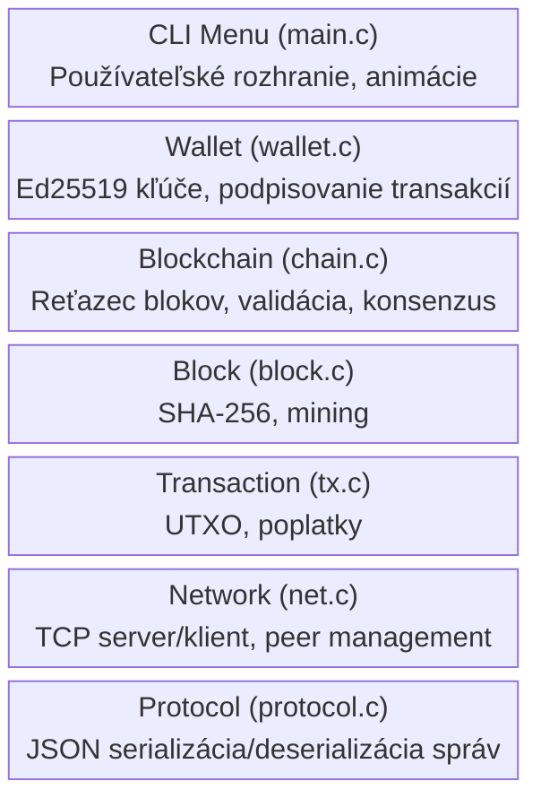
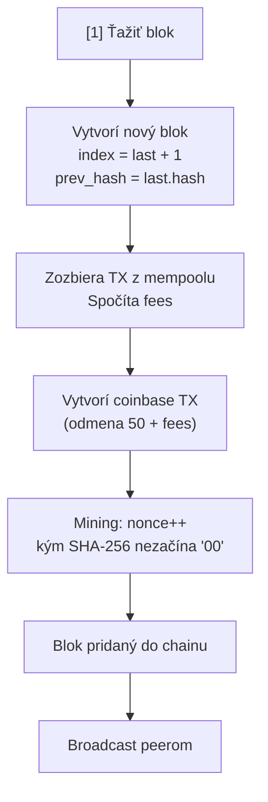
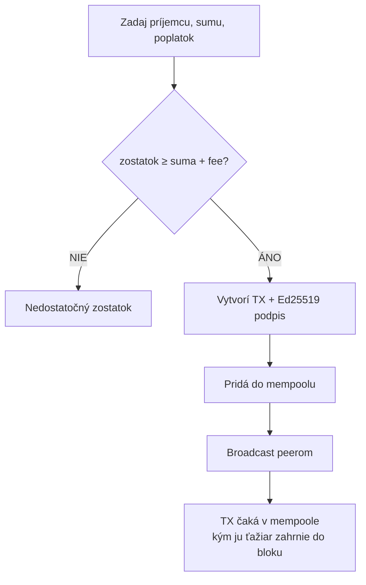
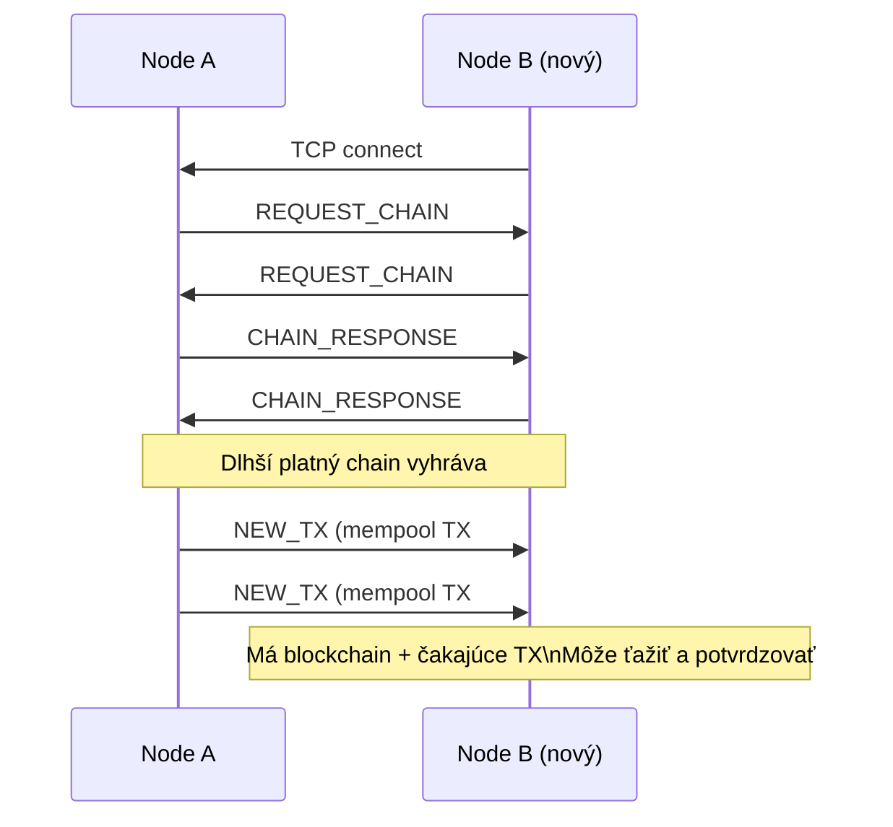

# Architektúra MiniCoin

## Prehľad

MiniCoin je zjednodušená implementácia decentralizovanej kryptomeny inšpirovanej Bitcoinom.
Každý node je samostatný proces, ktorý beží v termináli. Nodes sa navzájom pripájajú
cez TCP (priamo v LAN alebo cez VPN ako Tailscale/WireGuard) a tvoria peer-to-peer sieť.

## Vrstvy systému

## Moduly

### main.c — Hlavný modul

- Interaktívne CLI menu s animáciami (spinner, mining vizualizácia)
- Spravuje životný cyklus aplikácie (wallet, chain, node)
- Mempool je pole čakajúcich transakcií chránené mutexom
- Callbacky pre sieťové udalosti (nová TX, pripojenie peera)
- Spája všetky moduly dohromady

### block.c / block.h — Blok

- **Štruktúra bloku**: index, timestamp, transakcie, prev_hash, nonce, hash
- **Hashing**: SHA-256 cez OpenSSL (`EVP_DigestInit/Update/Final`)
- **Mining**: brute-force hľadanie nonce, kde hash začína na `MINING_DIFFICULTY` núl
- **Validácia**: overenie, že hash zodpovedá obsahu a spĺňa difficulty

### chain.c / chain.h — Blockchain

- **Uloženie**: statické pole blokov (max 10 000)
- **Thread-safety**: `pthread_mutex_t` chráni pred súbežným prístupom (mining vs. sieť)
- **Pridávanie blokov**: validácia indexu, prev_hash a hash; duplicitné bloky sa ticho ignorujú
- **Konsenzus**: longest valid chain wins (`chain_replace`)
- **Zostatok**: počíta sa prehľadaním všetkých transakcií (amount + fee)

### tx.c / tx.h — Transakcie

- **Bežná transakcia**: sender, receiver, amount, fee, signature, tx_hash
- **Coinbase transakcia**: špeciálna TX s odosielateľom "COINBASE", odmena + fees
- **Hash**: SHA-256 z (sender + receiver + amount + fee)
- **Poplatky**: minimálny fee je 1 coin, ťažiar zbiera fees zo všetkých TX v bloku

### wallet.c / wallet.h — Peňaženka

- **Kľúčový pár**: Ed25519 cez OpenSSL
- **Adresa**: hex-encoded public key (64 znakov)
- **Podpisovanie**: Ed25519 podpis tx_hash
- **Verifikácia**: rekonštrukcia public key z adresy odosielateľa
- **Perzistencia**: PEM súbor (`wallet.pem`)

### net.c / net.h — Sieť

- **TCP server**: počúva na porte, prijíma spojenia
- **Peer management**: max 16 peers, každý má vlastné vlákno
- **Broadcast**: nové bloky a transakcie sa posielajú všetkým peers
  - Blok sa nepreposiela späť odosielateľovi (prevencia slučiek)
- **Synchronizácia pri pripojení**:
  - Oba nodes si navzájom vyžiadajú chain (REQUEST_CHAIN)
  - Mempool sa synchronizuje, nový peer dostane všetky čakajúce TX
- **Správy**: JSON zakončené newline, čítané po bajtoch

### protocol.c / protocol.h — Protokol

- **Formát**: jednoriadkový JSON `{"type": <int>, "payload": <json>}\n`
- **Typy správ**: NEW_BLOCK, NEW_TX, REQUEST_CHAIN, CHAIN_RESPONSE, PING, PONG
- **JSON parsing**: manuálny (bez externej knižnice), počítanie vnorených zátvoriek
- **Serializácia**: bloky, transakcie, celý blockchain

## Dátový tok

### Ťaženie bloku

### Odoslanie transakcie

### Pripojenie peera

### Synchronizácia mempoolu

Mempool je lokálny pre každý node. Aby nový node mohol ťažiť a potvrdiť
čakajúce transakcie, pri pripojení dostane všetky TX z mempoolu peera.

Bez tejto synchronizácie by nový node nevedel o nepotvrdených transakciách
a vyťažený blok by obsahoval len coinbase odmenu.

## Dôležité pravidlá

### Transakcie sa nepotvrdia samy

Transakcia po odoslaní existuje len v mempoole. Kým niekto nevyťaží blok
a nezahrnie ju, zostatky sa nezmenia. Fee motivuje ťažiarov potvrdzovať TX.

### Offline ťaženie

Ťažiť je technicky možné aj offline. Ale po pripojení k sieti sa tvoj chain
pravdepodobne nahradí dlhším chainom siete → tvoje offline bloky zmiznú.
V reálnom Bitcoine je to rovnako, jeden počítač neprekoná výkon celej siete.

### Jedna cesta pripojenia

Medzi dvoma nodes by malo existovať len **jedno TCP spojenie**. Pripojenie
cez dve rôzne cesty (napr. LAN aj VPN súčasne) spôsobí duplicitné správy.

## Bezpečnostné mechanizmy

| Mechanizmus | Implementácia |
|---|---|
| **Proof of Work** | Hash bloku musí začínať na N núl |
| **Digitálny podpis** | Ed25519 podpis každej transakcie |
| **Chain validácia** | Každý blok overuje prev_hash a hash |
| **Double-spending** | UTXO validácia pri zahrnutí TX do bloku |
| **Longest chain** | Konsenzus — najdlhší platný chain vyhráva |
| **Thread-safety** | Mutexy na blockchain a mempool |

## Čo MiniCoin nemá (a reálny Bitcoin áno)

### Merkle Tree

V Bitcoine sa transakcie hashujú do stromovej štruktúry. Výhoda: na overenie
jednej transakcie netreba stiahnuť celý blok, stačí niekoľko hashov (Merkle proof).
Dôležité pre mobilné peňaženky (SPV klienti). MiniCoin zreťazí TX hashe priamo.

### Bitcoin Script

V Bitcoine transakcia obsahuje malý program definujúci podmienky utratenia:
multisig (2 z 3 podpisov), timelock (utratenie až po čase), hash lock (Lightning Network).
MiniCoin má len jednoduché "sender → receiver" s jedným podpisom.

### Ďalšie zjednodušenia

- **Difficulty**: fixné 2 nuly (nie dynamické)
- **Halving**: nie je implementovaný (odmena je vždy 50)
- **UTXO model**: zjednodušený (balance sa počíta prehľadaním celého chainu)
- **Mempool**: jednoduché pole, nie prioritná fronta podľa fee
- **Peer discovery**: manuálne pripojenie, nie DNS seeds
