# MiniCoin – Deep Dive

Rozšírená dokumentácia pokrývajúca pokročilé koncepty blockchainu, bezpečnostné mechanizmy a porovnania s Bitcoinom.

## Obsah

1. [Merkle strom](#merkle-strom)
2. [UTXO model vs. kumulatívny súčet](#utxo-model-vs-kumulatívny-súčet)
3. [Double-spending útok](#double-spending-útok)
4. [Halving a ekonomika](#halving-a-ekonomika)
5. [Cesta transakcie od vytvorenia po potvrdenie](#cesta-transakcie-od-vytvorenia-po-potvrdenie)
6. [Ed25519 vs ECDSA (secp256k1)](#ed25519-vs-ecdsa-secp256k1)
7. [Časová os Bitcoin protokolu](#časová-os-bitcoin-protokolu)
8. [Praktické príklady](#praktické-príklady)

---

## Merkle strom

### Čo je Merkle strom?

Merkle strom (hash strom) je dátová štruktúra, v ktorej sa transakcie hashujú po pároch, až kým nezostane jeden koreňový hash – **Merkle root**. Tento root sa uloží do hlavičky bloku.

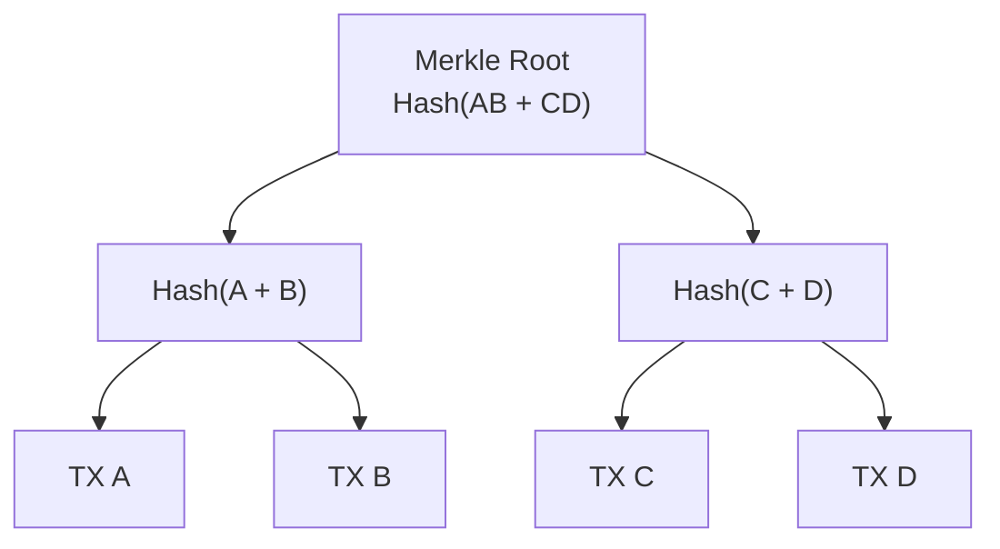

### Prečo je to užitočné?

**1. Efektívna verifikácia (SPV – Simplified Payment Verification)**

Ľahký klient (napr. mobilná peňaženka) nepotrebuje sťahovať celý blockchain. Stačí mu hlavičky blokov a tzv. **Merkle proof** – cesta od transakcie ku koreňu:

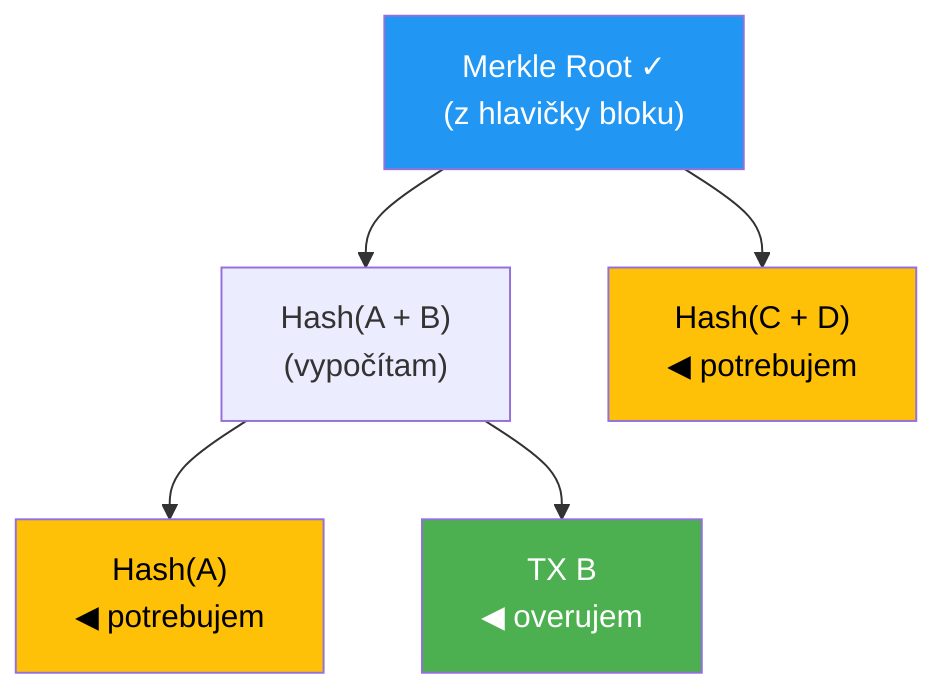

Na overenie TX B potrebujem len 2 hashe: Hash(A) a Hash(CD). Nie všetky 4 transakcie!

Pri 1 000 transakciách v bloku potrebujem len ~10 hashov namiesto 1 000. Pri 1 000 000 transakciách len ~20 hashov. Logaritmická zložitosť.

**2. Detekcia manipulácie**

Ak niekto zmení čo i len 1 bit v akejkoľvek transakcii, zmení sa celý Merkle root → hlavička bloku sa zmení → hash bloku sa zmení → reťazec sa rozbije.

### Ako to rieši MiniCoin?

MiniCoin **nepoužíva Merkle strom**. Namiesto toho jednoducho zreťazí všetky hashe transakcií:

```
MiniCoin:  hash = SHA-256(index || timestamp || prev_hash || nonce || tx_hash1 || tx_hash2 || ...)

Bitcoin:   header_hash = SHA-256(SHA-256(version || prev_hash || merkle_root || timestamp || bits || nonce))
```

**Dôsledky zjednodušenia:**
- Nie je možná SPV verifikácia – klient musí mať celý blok
- Stále bezpečné pre malú sieť – manipulácia sa detekuje pri plnej validácii
- Jednoduchšia implementácia

---

## UTXO model vs. kumulatívny súčet

### Bitcoin: UTXO (Unspent Transaction Output)

V Bitcoine neexistuje "zostatok na účte". Namiesto toho existujú **neminuté výstupy transakcií** (UTXO), ktoré fungujú ako digitálne "mince":

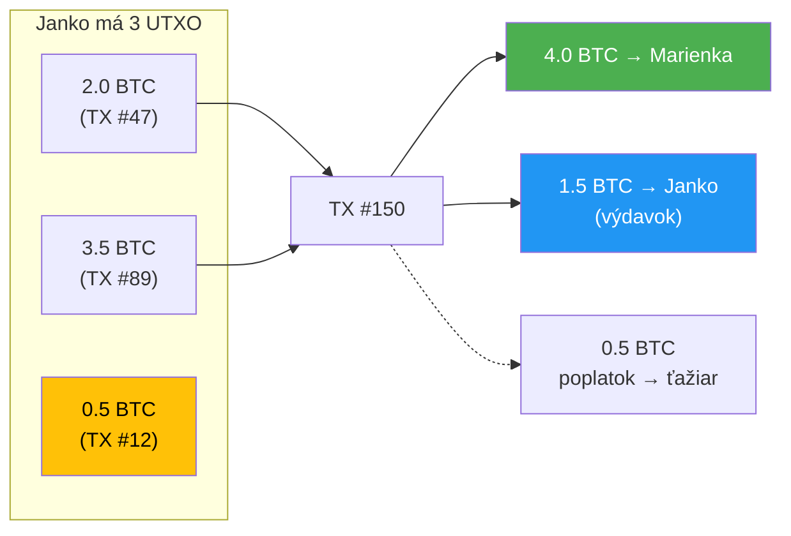

Po transakcii:
- Janko má: UTXO 0.5 BTC (TX #12) + UTXO 1.5 BTC (TX #150) = 2.0 BTC
- Marienka má: UTXO 4.0 BTC (TX #150)

**Výhody UTXO:**
- Paralelná validácia – nezávislé UTXO sa dajú overovať súčasne
- Lepšia privátnosť – každá transakcia môže používať iné adresy
- Atomicita – UTXO sa buď celé minie, alebo vôbec
- Jednoduchšia detekcia double-spendingu

### MiniCoin: kumulatívny súčet

MiniCoin používa jednoduchší prístup – prechádza celý blockchain a sčítava:

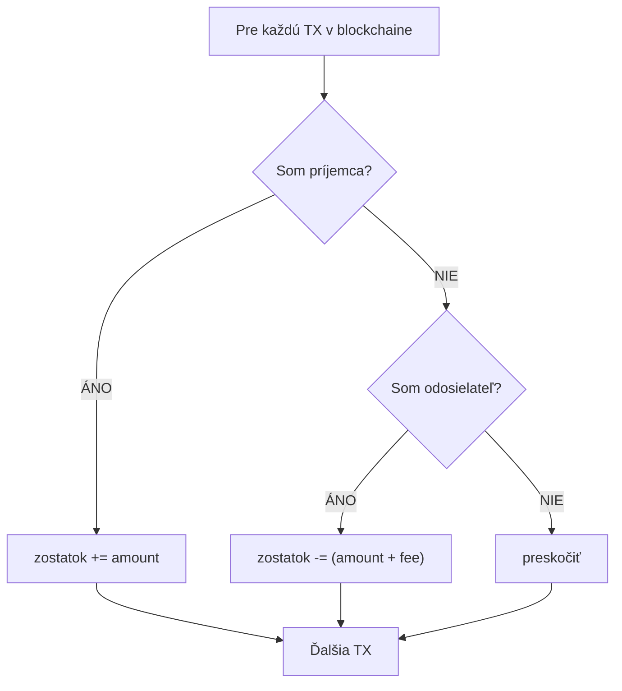

**Výhody zjednodušenia:**
- Ľahko pochopiteľné
- Menej kódu
- Postačujúce pre vzdelávacie účely

**Nevýhody:**
- Výpočet zostatku vyžaduje prechod celého blockchainu
- Nie je možné paralelné spracovanie
- Žiadna podpora pre viac adries na jednej peňaženke

---

## Double-spending útok

Double-spending (dvojité minutie) je fundamentálny problém digitálnych mien – ako zabrániť tomu, aby niekto minul tie isté mince dvakrát?

### Scenár útoku

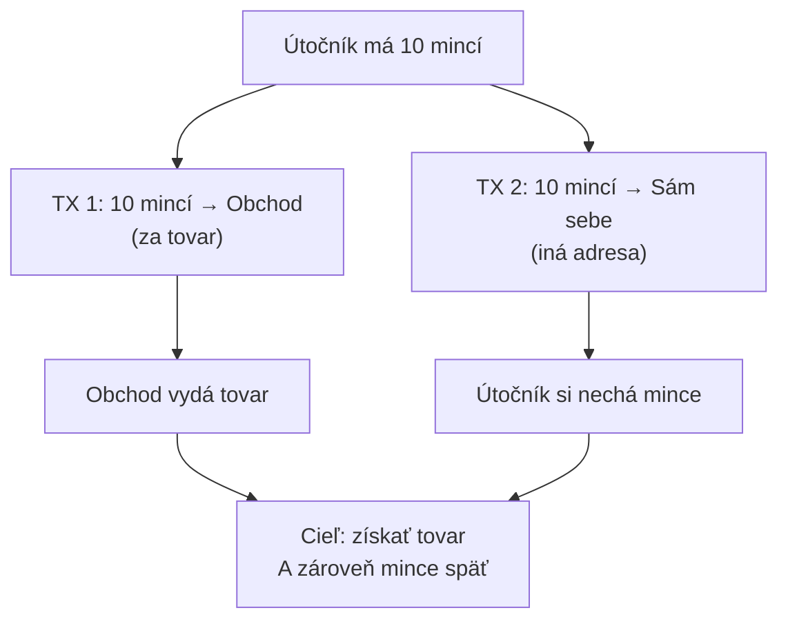

### Ako to Proof of Work zabraňuje

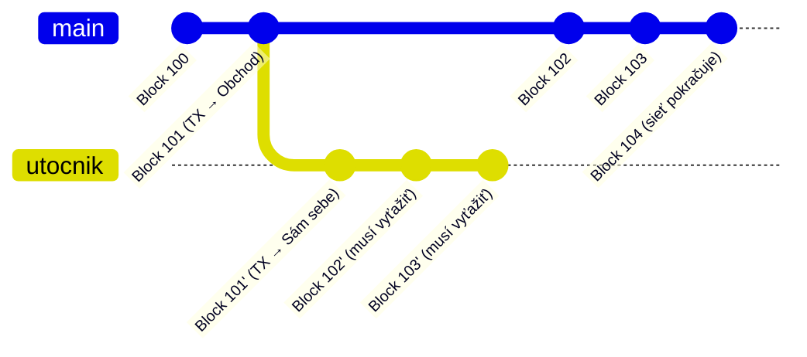

**Prečo to nefunguje:**

1. Útočník musí vyťažiť alternatívny reťazec **rýchlejšie** ako celá sieť ťaží čestný reťazec
2. Na to potrebuje **> 50% výpočtového výkonu** celej siete (tzv. 51% útok)
3. Čím viac blokov sa pridá po transakcii, tým je útok exponenciálne ťažší
4. Preto sa odporúča čakať na **6 potvrdení** (6 blokov po transakcii)

### Pravdepodobnosť úspechu útočníka

| Podiel výkonu útočníka | Pravdepodobnosť po 1 bloku | Po 6 blokoch |
|-------------------------|-----------------------------|---------------|
| 10% | 20.5% | 0.1% |
| 25% | 41.0% | 4.7% |
| 30% | 46.0% | 10.0% |
| 45% | 49.9% | 46.0% |
| 51% | 100% (časom) | 100% (časom) |

### Ako to rieši MiniCoin

MiniCoin používa rovnaký princíp – **najdlhší platný reťazec vyhráva** (`chain_replace()` v `src/chain.c`). Ak útočník vytvorí dlhší reťazec, sieť ho akceptuje. V malej sieti s nízkou obtiažnosťou je 51% útok triviálny – preto je MiniCoin vhodný len na vzdelávanie, nie na reálne použitie.

---

## Halving a ekonomika

### Bitcoin: kontrolovaná emisia

Bitcoin má pevne stanovený maximálny počet mincí: **21 000 000 BTC**. Odmena za blok sa halvuje (zníži na polovicu) každých 210 000 blokov (~4 roky):

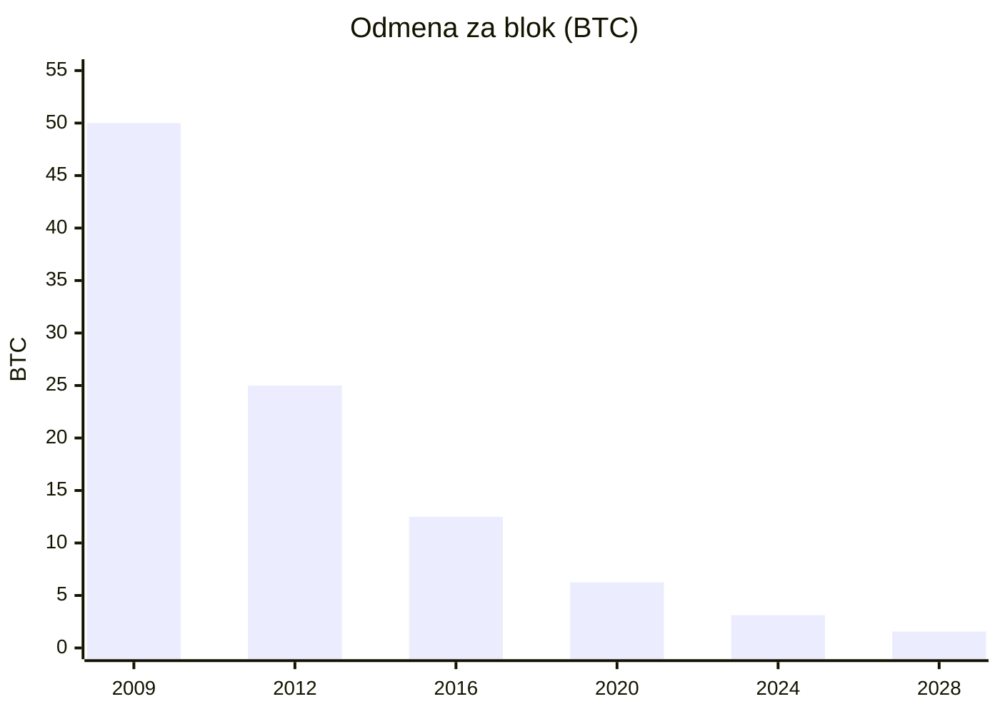

**Kľúčové dátumy:**

| Udalosť | Rok | Odmena | Celkom vyťažených |
|----------|-----|--------|--------------------|
| Genesis | 2009 | 50 BTC | 0 |
| 1. halving | 2012 | 25 BTC | 10 500 000 |
| 2. halving | 2016 | 12.5 BTC | 15 750 000 |
| 3. halving | 2020 | 6.25 BTC | 18 375 000 |
| 4. halving | 2024 | 3.125 BTC | 19 687 500 |
| Posledná minca | ~2140 | 0 BTC | 21 000 000 |

Po roku ~2140 budú ťažiari odmeňovaní **výlučne z transakčných poplatkov**.

### MiniCoin: neobmedzená emisia

- Odmena: fixných 50 mincí za blok (navždy)
- Žiadny halving
- Žiadny maximálny počet mincí
- Mince sa vytvárajú donekonečna
- V reálnom svete by to spôsobilo nekonečnú infláciu. Pre vzdelávací účel to však stačí.

### Prečo je halving dôležitý?

1. **Deflácia namiesto inflácie** – obmedzená zásoba = zvyšovanie hodnoty pri rastúcom dopyte
2. **Predvídateľnosť** – každý vie, koľko BTC bude existovať v ľubovoľnom čase
3. **Motivácia ťažiarov** – postupný prechod z odmien na poplatky zabezpečuje dlhodobú bezpečnosť siete
4. **Digitálne zlato** – rovnako ako zlato, Bitcoin je ťažšie "ťažiť" s pribúdajúcim časom

---

## Cesta transakcie od vytvorenia po potvrdenie

Kompletný životný cyklus transakcie v MiniCoin:

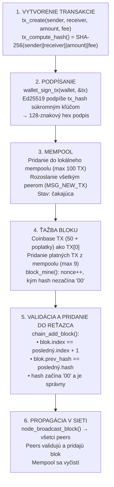

### Kde môže transakcia zlyhať?

| Krok | Možná chyba | Výsledok |
|------|-------------|----------|
| Podpísanie | Neplatný súkromný kľúč | TX sa nepodpíše |
| Mempool | Mempool plný (100 TX) | TX sa zahodí |
| Ťažba | Nedostatočný zostatok | TX sa preskočí |
| Validácia | Neplatný hash / prev_hash | Blok sa odmietne |
| Propagácia | Peer offline | Peer synchronizuje neskôr |

---

## Ed25519 vs ECDSA (secp256k1)

### MiniCoin: Ed25519

Ed25519 je schéma digitálnych podpisov postavená na eliptickej krivke Curve25519 (navrhol Daniel J. Bernstein, 2011).

| Parameter | Hodnota |
|-----------|---------|
| Krivka | Twisted Edwards curve (Curve25519) |
| Súkromný kľúč | 32 bajtov (256 bitov) |
| Verejný kľúč | 32 bajtov (256 bitov) |
| Podpis | 64 bajtov (512 bitov) |
| Bezpečnostná úroveň | ~128 bitov |

**Výhody Ed25519:**
- **Rýchlosť**: Podpisovanie aj overovanie sú veľmi rýchle
- **Konštantný čas**: Operácie bežia v konštantnom čase → odolnosť voči timing útokom
- **Malé kľúče a podpisy**: 32B kľúč, 64B podpis
- **Deterministické podpisy**: Rovnaká správa + kľúč = rovnaký podpis (žiadny náhodný nonce)
- **Odolnosť voči chybám**: Nevyžaduje kvalitný generátor náhodných čísel pri podpisovaní

### Bitcoin: ECDSA (secp256k1)

Bitcoin používa ECDSA (Elliptic Curve Digital Signature Algorithm) nad krivkou secp256k1.

| Parameter | Hodnota |
|-----------|---------|
| Krivka | secp256k1 (Koblitz curve) |
| Súkromný kľúč | 32 bajtov (256 bitov) |
| Verejný kľúč | 33 bajtov (komprimovaný) / 65 bajtov (nekomprimovaný) |
| Podpis | 70-72 bajtov (DER kódovanie) |
| Bezpečnostná úroveň | ~128 bitov |

### Porovnanie

| Vlastnosť | Ed25519 (MiniCoin) | ECDSA secp256k1 (Bitcoin) |
|-----------|-------------------|--------------------------|
| Rýchlosť podpisu | Veľmi rýchly | Rýchly |
| Rýchlosť overenia | Veľmi rýchly | Pomalší |
| Veľkosť podpisu | 64 B (fixná) | 70-72 B (variabilná) |
| Veľkosť verejného kľúča | 32 B | 33 B (komprimovaný) |
| Deterministický | Áno (vždy) | Voliteľne (RFC 6979) |
| Náchylnosť na nonce chyby | Nie | Áno (ak zlý RNG) |
| Batch verifikácia | Áno (natívne) | Nie (štandardne) |
| Rok vzniku | 2011 | 2000 (krivka 2009) |

### Prečo Bitcoin nepoužíva Ed25519?

- Keď Satoshi Nakamoto v roku 2008-2009 navrhoval Bitcoin, Ed25519 ešte neexistoval
- secp256k1 bola menej používaná krivka (väčšina systémov používala P-256), čo niektorí považujú za výhodu – menšia šanca na backdoor od NSA
- Migrácia na iný podpisový algoritmus by vyžadovala hard fork
- Novšie kryptomeny (Solana, Cardano, Stellar) už používajú Ed25519

### MiniCoin adresa vs Bitcoin adresa

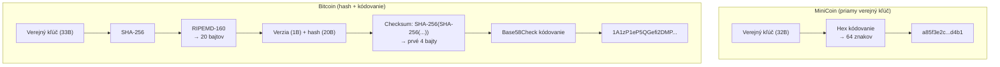

Bitcoin pridáva RIPEMD-160 hash a Base58 kódovanie pre kratšie adresy a detekciu preklepov (checksum).

---

## Časová os Bitcoin protokolu

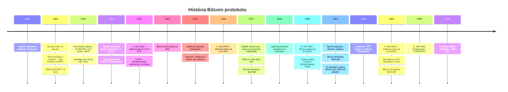

### Kľúčové technické vylepšenia

| Vylepšenie | Rok | Čo riešilo |
|-----------|------|-------------|
| **P2SH** | 2012 | Komplexnejšie podmienky pre transakcie (multisig) |
| **SegWit** | 2017 | Transaction malleability, efektívnejšie bloky |
| **Lightning** | 2018 | Škálovanie – milióny TX za sekundu off-chain |
| **Taproot** | 2021 | Schnorr podpisy, lepšia privátnosť smart kontraktov |
| **Ordinals** | 2023 | NFT a dáta priamo na Bitcoin blockchaine |

---

## Praktické príklady

### Príklad 1: Hash bloku

Vstup pre hash funkciu:

```
index:     1
timestamp: 1700000000
prev_hash: 00a1b2c3d4e5f6a7b8c9d0e1f2a3b4c5d6e7f8a9b0c1d2e3f4a5b6c7d8e9f0a1
nonce:     142
tx_hashes: abc123...def456...

Zreťazený vstup:
"1|1700000000|00a1b2c3d4...f0a1|142|abc123...def456..."
```

Výstup SHA-256:

```
NEPLATNÝ hash (nonce=141): "7f3a2b1c9d8e..."  ← nezačína "00"
NEPLATNÝ hash (nonce=142): "e5d4c3b2a1f0..."  ← nezačína "00"
   PLATNÝ hash (nonce=143): "0045cd89ef12..."  ← začína "00" ✓
```

### Príklad 2: Neplatný vs platný blok

```json
// PLATNÝ BLOK:
{
  "index": 1,
  "timestamp": 1700000000,
  "prev_hash": "00a1b2c3...f0a1",
  "nonce": 143,
  "hash": "0045cd89...1234",
  "tx_count": 2,
  "transactions": [
    {
      "sender": "COINBASE",
      "receiver": "a85f3e2c...d4b1",
      "amount": 51,
      "fee": 0,
      "signature": "COINBASE",
      "tx_hash": "abc123..."
    },
    {
      "sender": "a85f3e2c...d4b1",
      "receiver": "b2d4f6a8...c3e5",
      "amount": 10,
      "fee": 1,
      "signature": "def456...789abc",
      "tx_hash": "xyz789..."
    }
  ]
}
```

```json
// NEPLATNÝ BLOK – 3 problémy:
{
  "index": 1,
  "timestamp": 1700000000,
  "prev_hash": "ff00112233...",       // ✗ nezhoduje sa s hashom bloku 0
  "nonce": 5,
  "hash": "a8b7c6d5e4...",           // ✗ nezačína "00"
  "tx_count": 1,
  "transactions": [
    {
      "sender": "COINBASE",
      "receiver": "a85f3e2c...d4b1",
      "amount": 9999,                 // ✗ nadmerná odmena
      "fee": 0
    }
  ]
}
```

### Príklad 3: JSON správa medzi uzlami

Nový blok sa propaguje v sieti ako JSON správa:

```json
{"type": 0, "payload": {"index":1,"timestamp":1700000000,"prev_hash":"00a1b2...","nonce":143,"hash":"0045cd...","tx_count":1,"transactions":[{"sender":"COINBASE","receiver":"a85f3e...","amount":50,"fee":0,"signature":"COINBASE","tx_hash":"abc123..."}]}}
```

Rozloženie:
- `type: 0` = `MSG_NEW_BLOCK`
- `type: 1` = `MSG_NEW_TX`
- `type: 2` = `MSG_REQUEST_CHAIN`
- `type: 3` = `MSG_CHAIN_RESPONSE`
- Správa je ukončená znakom `\n` (newline-delimited JSON)

### Príklad 4: Overenie podpisu

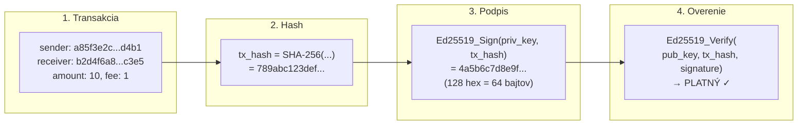
