# MiniCoin — Diagramy

## 1. Životný cyklus transakcie

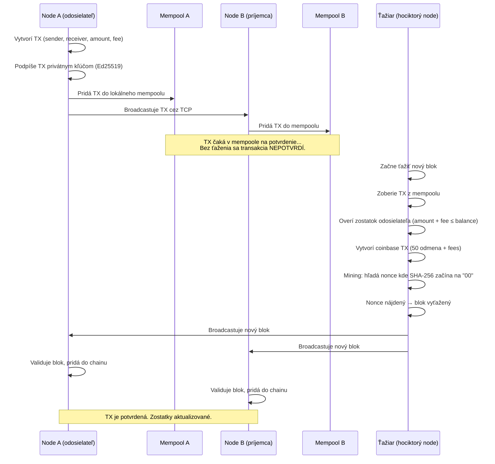

## 2. Pripojenie peera — synchronizácia chain + mempool

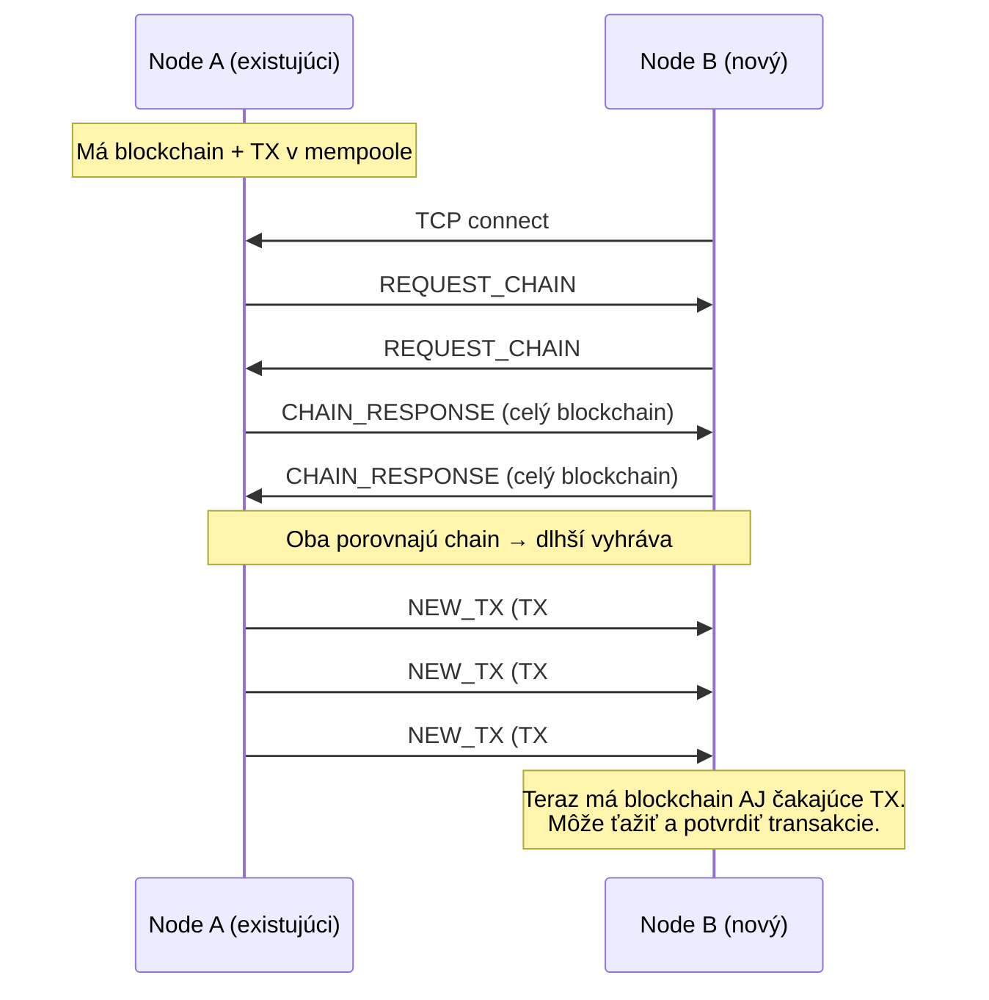

## 3. Scenár s 3 nodes (LAN + VPN)

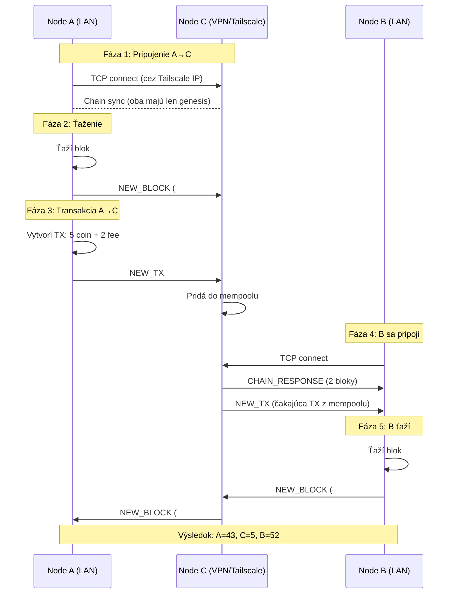

## 4. Štruktúra bloku

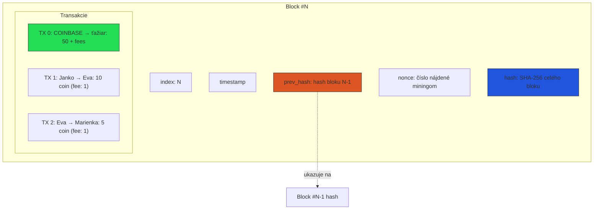

## 5. Blockchain — reťazec blokov

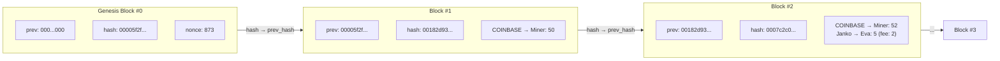

## 6. Mining (Proof of Work)

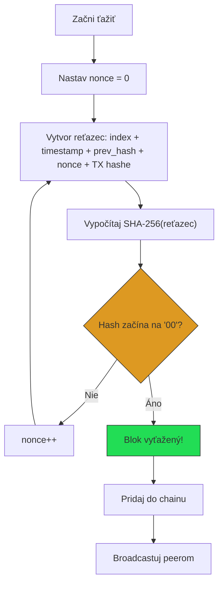

## 7. Konsenzus — Longest Chain Wins

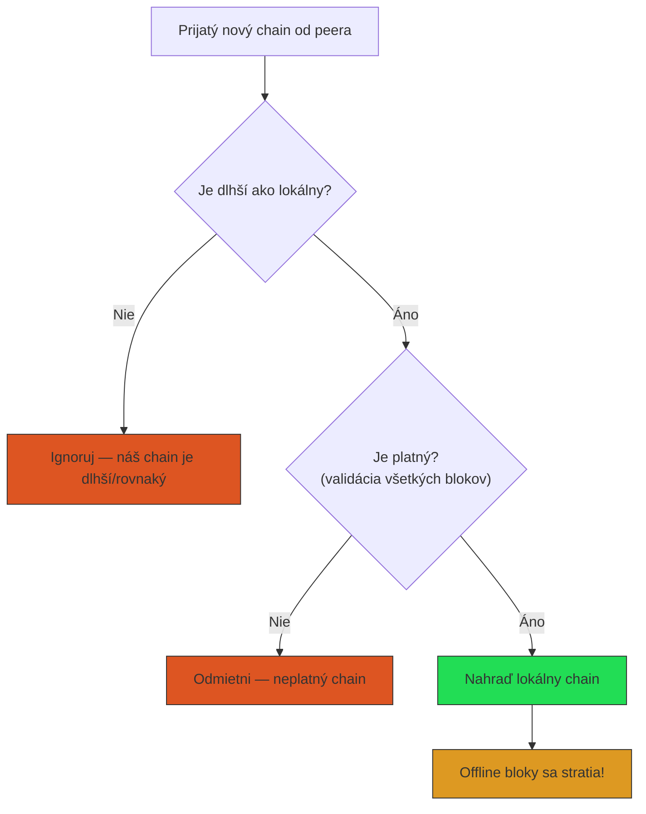

## 8. Offline ťaženie — prečo nefunguje

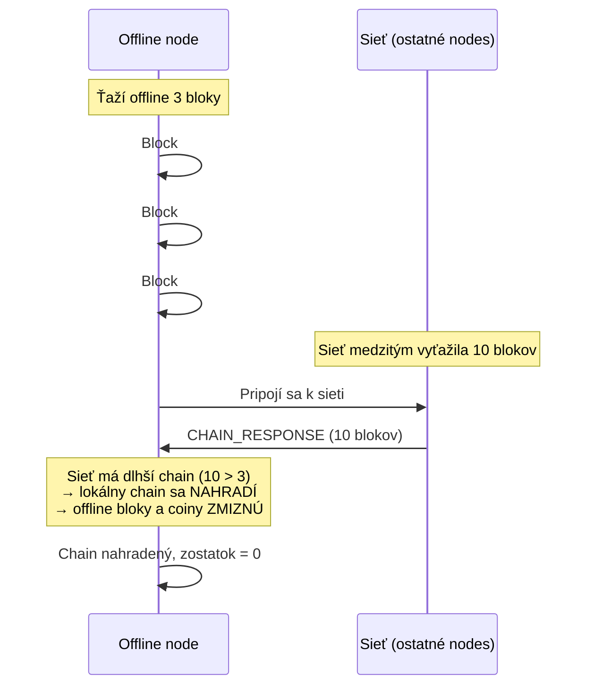

## 8b. Lokálne ťaženie vs. sieť — porovnanie chainov

```mermaid
graph TD
    subgraph "Offline node — ťažil 3 bloky"
        OG["Genesis #0"] --> O1["Block #1<br/>COINBASE → Ja: 50"]
        O1 --> O2["Block #2<br/>COINBASE → Ja: 50"]
        O2 --> O3["Block #3<br/>COINBASE → Ja: 50"]
        BAL_O["Môj zostatok: 150 coin"]
    end

    subgraph "Sieť — vyťažila 7 blokov"
        SG["Genesis #0"] --> S1["Block #1"]
        S1 --> S2["Block #2"]
        S2 --> S3["Block #3"]
        S3 --> S4["Block #4"]
        S4 --> S5["Block #5"]
        S5 --> S6["Block #6"]
        S6 --> S7["Block #7"]
    end

    subgraph "Po pripojení"
        R["Sieť má 7 blokov > moje 3 bloky"]
        R --> D["Môj chain sa NAHRADÍ sieťovým"]
        D --> L["Moje offline bloky ZMIZLI"]
        L --> Z["Môj zostatok: 0 coin"]
    end

    style O1 fill:#d52,stroke:#333
    style O2 fill:#d52,stroke:#333
    style O3 fill:#d52,stroke:#333
    style BAL_O fill:#d52,stroke:#333
    style Z fill:#d52,stroke:#333
    style S7 fill:#2d5,stroke:#333
```

**Prečo sa to stane?** Konsenzus pravidlo „longest chain wins" existuje preto,
aby sa sieť vždy zhodla na jednej verzii pravdy. Jeden počítač nemá šancu
prekonať výkon celej siete, preto sa oplatí vždy najprv pripojiť a až potom ťažiť.

V reálnom Bitcoine je to rovnaký princíp. Preto existujú mining pooly 
ťažiari spájajú výkon, aby mali väčšiu šancu nájsť blok. Sólo ťaženie
na jednom počítači je dnes prakticky bezvýznamné.

## 9. Peer-to-Peer sieť — topológia

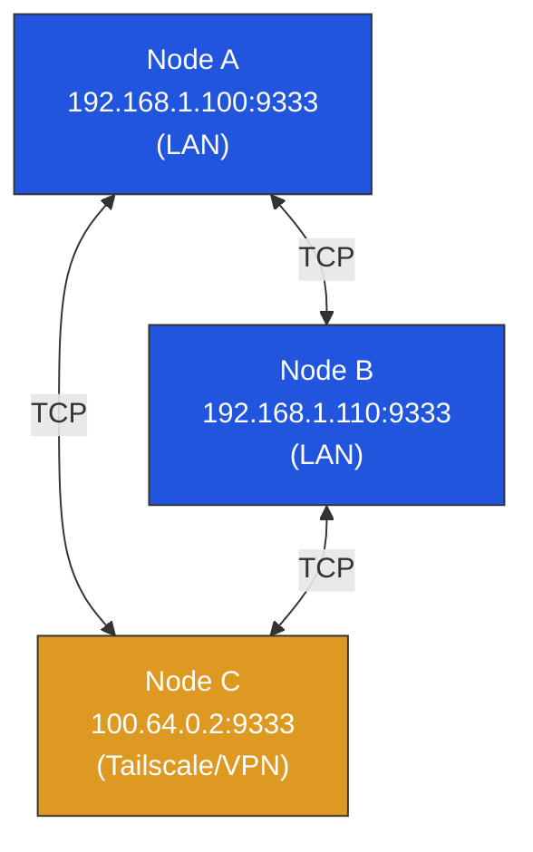

Nodes sa pripájajú priamo cez TCP. V LAN cez lokálnu IP,
cez VPN (Tailscale, WireGuard) cez VPN IP adresu.
Nie je potrebný žiadny tunel ani špeciálna konfigurácia.

**Dôležité**: medzi dvoma nodes by malo byť len jedno spojenie.
Pripojenie cez dve cesty (LAN + VPN) spôsobí duplicitné správy.

## 10. Tok peňazí — príklad

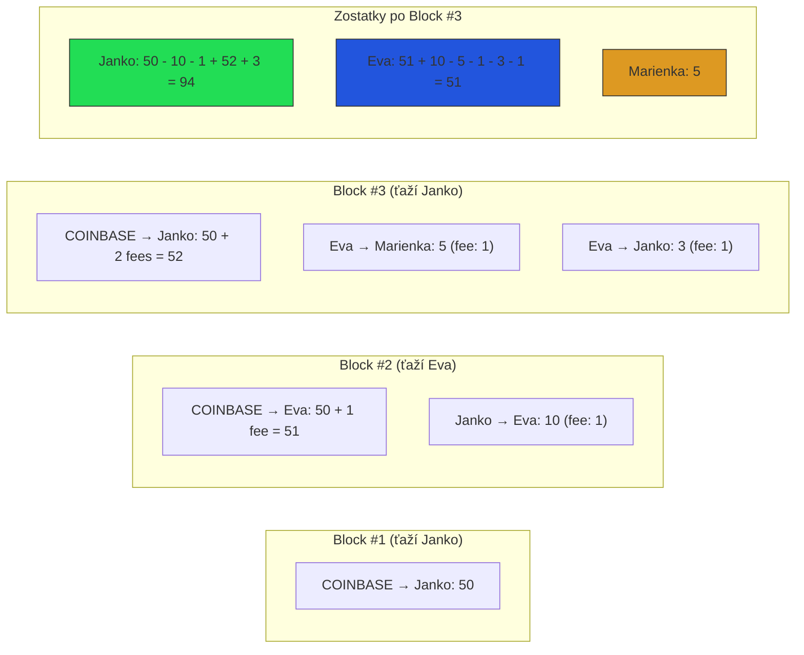

## 11. Prečo sú fees dôležité

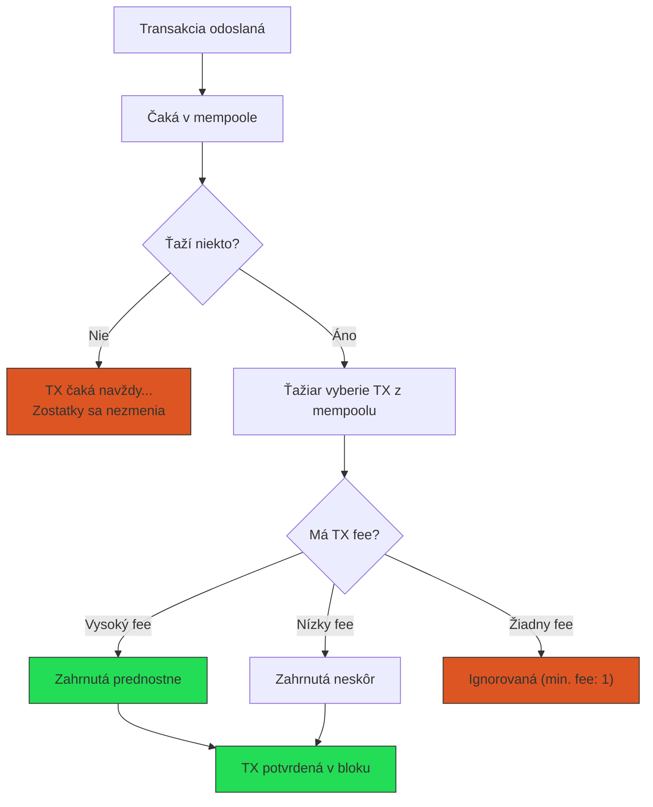

## 12. Štruktúra transakcie a podpisovanie

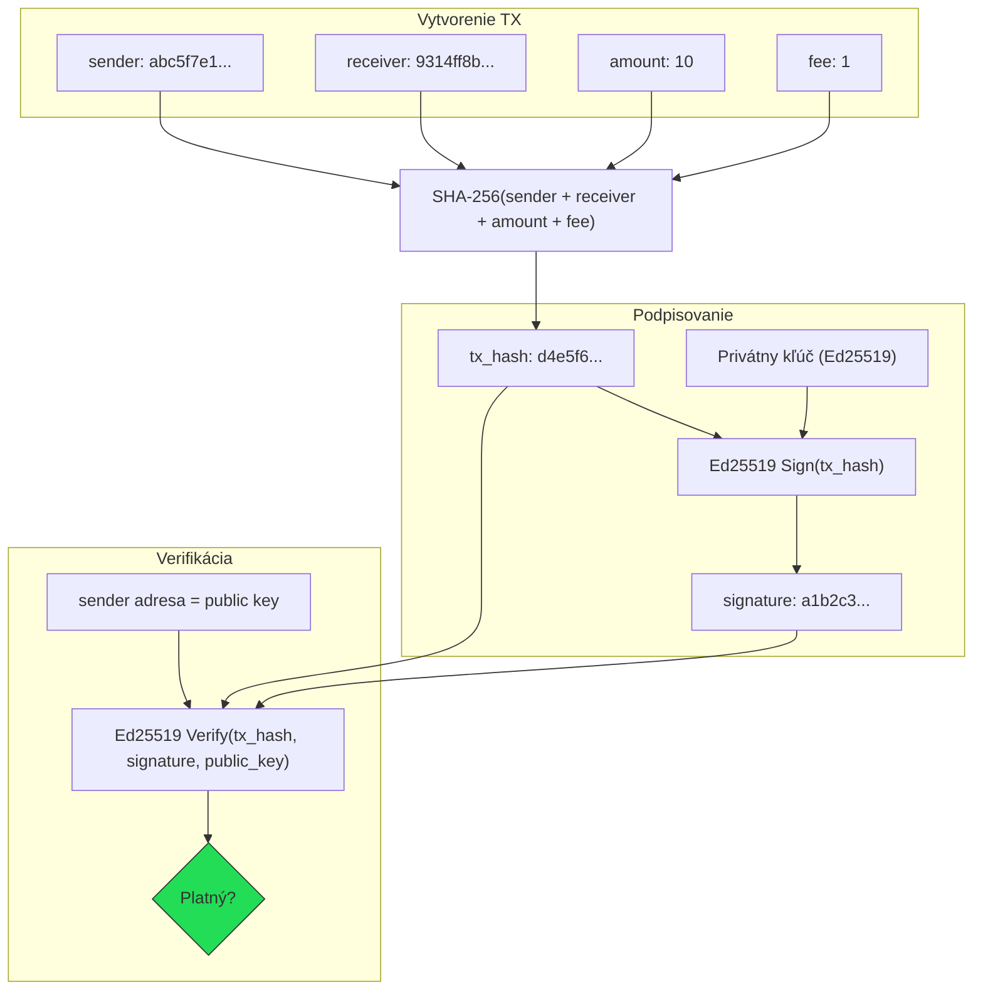

## 13. Merkle Tree (reálny Bitcoin) vs. MiniCoin

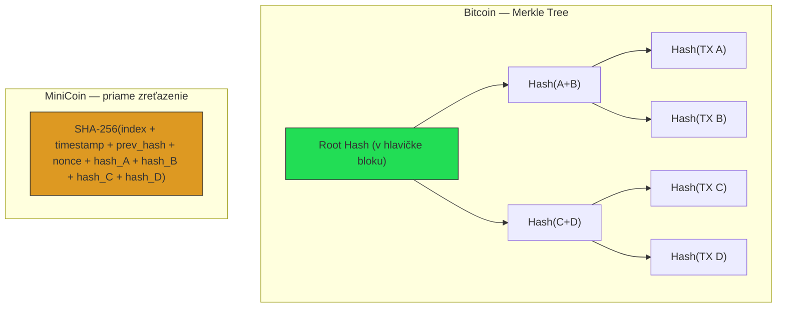

Merkle tree umožňuje overiť jednu TX bez stiahnutia celého bloku (SPV proof).
MiniCoin to nepotrebuje, každý node má celý blockchain.
